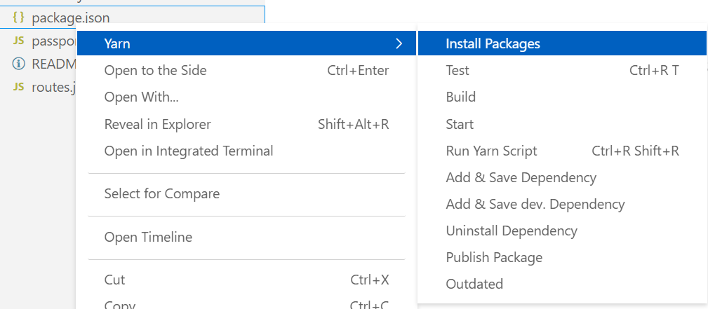

<p align="center">
  
  <br>
  <a href="https://github.com/gamunu/vscode-yarn/releases/latest"></a>
  <a href="https://code.visualstudio.com/updates/v1_19"></a>
  <a href="https://marketplace.visualstudio.com/items?itemName=gamunu.vscode-yarn"></a>
  <a href="https://github.com/gamunu/vscode-yarn/issues"></a>
</p>
<p align="center">VSCode-Yarn: VSCode extensions to manage yarn commands.</p>

## Getting started

You can install this awesome extension through the [VSCode-Yarn](https://marketplace.visualstudio.com/items?itemName=gamunu.vscode-yarn).

### Installation

Launch *Quick Open*
  -  <a href="https://code.visualstudio.com/shortcuts/keyboard-shortcuts-linux.pdf">Linux</a> `Ctrl+P`
  -  <a href="https://code.visualstudio.com/shortcuts/keyboard-shortcuts-macos.pdf">macOS</a> `⌘P`
  -  <a href="https://code.visualstudio.com/shortcuts/keyboard-shortcuts-windows.pdf">Windows</a> `Ctrl+P`

Paste the following command and press `Enter`:

```shell
ext install gamunu.vscode-yarn
```

#### Packaged VSIX Extension <sup>[↑](#getting-started)</sup>

[Download the latest .vsix release](https://github.com/gamunu/vscode-yarn/releases/latest) file from the GitHub repository and install it from the command line

```shell
code --install-extension vscode-yarn-*.*.*.vsix
```

or from within VS Code by launching *Quick Open* and running the *Install from VSIX...* command.

##### GitHub Repository Clone <sup>[↑](#getting-started)</sup>

Change to your `.vscode/extensions` [VS Code extensions directory](https://code.visualstudio.com/docs/extensions/install-extension#_side-loading).
Depending on your platform it is located in the following folders:

  -  **Linux** `~/.vscode/extensions`
  -  **macOs** `~/.vscode/extensions`
  -  **Windows** `%USERPROFILE%\.vscode\extensions`

Clone the Material Theme repository as `gamunu.vscode-yarn`:

```shell
git clone git@github.com:gamunu/vscode-yarn.git gamunu.vscode-yarn
```
## Features

### Commands

* `yarn init`
* `yarn install`
* `yarn add`
* `yarn add --dev`
* `yarn remove <pkg>`
* `yarn start`
* `yarn test`
* `yarn build`
* `yarn publish [tag]`
* `yarn run <script>`

 Not happy with the available commands ? No problem, `raw command` is also available. Enter any yarn command you want.

### Explorer context menu

`yarn install` also available in the `package.json` file's explorer context menu.



### TouchBar support

Support for Macbook Pro Touch Bar. Following yarn commands are available:

- yarn install
- yarn start
- yarn test
- yarn build


### Run last executed script

You can also run the last executed script by typing `yarn run last...`.

### Terminate a script

You can terminate a script with the `terminate` command. It uses the `tree-kill` module that you can find on `yarn`.
It has different behaviors on Unix or Windows.

### Order of execution of yarn commands

01. If a package.json is opened as an active editor/focused tab yarn will be invoked on it.
02. If the package.json is explicitly defined in the configuration yarn will invoke on it.
02. If above scenarios fail to satisfy. The extension will fallback to package.json in project root folder.

## Settings

- `yarn.runInTerminal` Defines whether the command is run in a terminal window or whether the output form the command is shown in the `Output` window. The default is to show the output in the output window.
- `yarn.dontHideOutputOnSuccess` Keep the output panel visible when yarn execution is successful. No effect with runInTerminal. The default is to keep output window open.
- `yarn.bin` Custom yarn bin name, the default is `yarn`.
- `yarn.packageJson` Default package json path. relative to current project root.
- `yarn.enableTouchbar` Enable TouchBar support in MacOSX. TouchBar support includes:
   - yarn install
   - yarn run build
   - yarn run test
   - yarn run start

##### Example
```javascript
{
  "yarn.runInTerminal": false,
  "yarn.dontHideOutputOnSuccess": false
  "yarn.packageJson": "src/package.json"
}
```

## Keyboard Shortcuts

The extension defines a chording keyboard shortcut for the `R` key. As a consequence an existing keybinding for `R` is not executed immediately. If this is not desired, then please bind another key for these commands, see the [customization](https://code.visualstudio.com/docs/customization/keybindings) documentation.

## Contribute

Report a bug or a suggestion by posting an issue on the git repository (https://github.com/gamunu/vscode-yarn).

vscode-yarn incorporates code modified from [fknop vscode-npm](https://github.com/fknop/vscode-npm).
